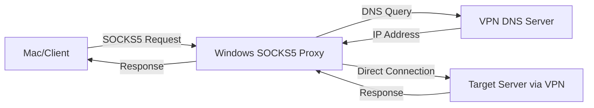

# VPN SOCKS5 Proxy

A lightweight SOCKS5 proxy server that enables seamless VPN access sharing between Windows and other devices (Mac, Linux, mobile). Perfect for accessing VPNs, geo-restricted content, or any network resources available only through a VPN connection on your Windows machine.

## 🎯 Use Cases

- **Corporate VPN Sharing**: Access your company's VPN-protected resources from Mac/Linux when VPN client is only available on Windows
- **Multi-Device VPN Access**: Share a single VPN connection across multiple devices
- **Development & Testing**: Test applications through different network paths
- **Geo-location Access**: Access region-locked services through your Windows VPN
- **Network Troubleshooting**: Route specific traffic through VPN while keeping other traffic direct

## 🚀 Features

- ✅ **DNS Resolution Fix**: Correctly parses DNS responses from VPN servers (fixes common DNS parsing bugs)
- ✅ **VPN-First DNS**: Prioritizes VPN DNS servers for proper internal domain resolution
- ✅ **Fallback Support**: Automatically falls back to system DNS if VPN DNS fails
- ✅ **Multi-threaded**: Handles multiple concurrent connections efficiently
- ✅ **Detailed Logging**: Comprehensive logging for debugging and monitoring
- ✅ **Easy Management**: Simple scripts for start/stop/status checking
- ✅ **Cross-Platform Client Support**: Works with any SOCKS5-compatible client

## 📋 Requirements

### Windows (Server Side)
- **Python 3.6+** (built-in on Windows 10/11 or download from python.org)
- **Active VPN Connection** (any VPN client: OpenVPN, WireGuard, Cisco AnyConnect, etc.)
- **Network Access** between devices (same LAN or direct connection)

### Client Side (Mac, Linux, Mobile, etc.)
- **SOCKS5 Support**: Browser extension (FoxyProxy), system proxy settings, or application-specific proxy configuration

## 🔧 Quick Start

### 1. Setup on Windows (VPN Server)

```bash
# Clone the repository
git clone https://github.com/yourusername/vpn-socks5-proxy.git
cd vpn-socks5-proxy

# Start the proxy (will auto-detect your network interface)
python socks5_proxy.py

# Or use the management scripts
start_proxy.bat                # Windows batch file
./start_proxy.sh              # Linux/Mac script
```

### 2. Configure Client Device

#### Chrome/Firefox with FoxyProxy
1. Install FoxyProxy extension
2. Add new proxy:
   - **Host**: `192.168.1.XXX` (your Windows IP)
   - **Port**: `1081`
   - **Type**: SOCKS5
3. Enable proxy for specific domains or all traffic

#### System-wide (Mac/Linux)
```bash
# Test connection
curl --socks5 192.168.1.XXX:1081 https://your-vpn-protected-site.com

# Configure system proxy (varies by OS)
export https_proxy=socks5://192.168.1.XXX:1081
export http_proxy=socks5://192.168.1.XXX:1081
```

#### Mobile Devices
- **iOS**: Settings → Wi-Fi → Configure Proxy → Manual
- **Android**: Wi-Fi Settings → Advanced → Proxy → Manual

## 📁 Project Structure

```
vpn-socks5-proxy/
├── socks5_proxy.py           # Main SOCKS5 proxy server
├── management/
│   ├── start_proxy.bat       # Windows startup script
│   ├── start_proxy.sh        # Linux/Mac startup script
│   ├── check_status.bat      # Check if proxy is running
│   ├── kill_proxy.bat        # Stop the proxy
│   └── create_shortcut.bat   # Create desktop shortcut
├── docs/
│   ├── SETUP.md             # Detailed setup instructions
│   ├── TROUBLESHOOTING.md   # Common issues and solutions
│   └── ADVANCED.md          # Advanced configuration options
├── examples/
│   ├── foxyproxy_config.json # FoxyProxy configuration example
│   └── test_connection.py    # Connection testing script
├── README.md                # This file
├── LICENSE                  # MIT License
└── .gitignore              # Git ignore rules
```

## 🔍 How It Works



1. **Client** sends SOCKS5 request to Windows proxy
2. **Proxy** resolves domain using VPN DNS servers
3. **Proxy** establishes connection to target through VPN tunnel
4. **Traffic** is relayed bidirectionally between client and target

## 🛠️ Management Scripts

| Script | Purpose | Usage |
|--------|---------|-------|
| `start_proxy.bat` | Start the SOCKS5 proxy | Double-click or `start_proxy.bat` |
| `check_status.bat` | Check if proxy is running | `check_status.bat` |
| `kill_proxy.bat` | Stop the proxy | `kill_proxy.bat` |
| `create_shortcut.bat` | Create desktop shortcut | Run once |

## 🔧 Configuration

The proxy auto-detects your network configuration, but you can customize:

```python
# In socks5_proxy.py
LISTEN_HOST = '0.0.0.0'        # Listen on all interfaces
LISTEN_PORT = 1081             # SOCKS5 port
VPN_DNS_SERVERS = [            # VPN DNS servers (auto-detected)
    '10.19.1.23',
    '10.36.1.53'
]
```

## 🐛 Troubleshooting

### Connection Refused
- Verify Windows firewall allows Python on port 1081
- Check that devices are on same network
- Confirm VPN is active on Windows machine

### DNS Resolution Issues
- Ensure VPN DNS servers are accessible
- Check VPN configuration for DNS leaks
- Try different VPN DNS servers

### Performance Issues
- Close unnecessary applications on Windows
- Check network bandwidth and latency
- Consider reducing concurrent connections

See [TROUBLESHOOTING.md](docs/TROUBLESHOOTING.md) for detailed solutions.

## 🤝 Contributing

1. Fork the repository
2. Create a feature branch (`git checkout -b feature/amazing-feature`)
3. Commit your changes (`git commit -m 'Add amazing feature'`)
4. Push to the branch (`git push origin feature/amazing-feature`)
5. Open a Pull Request

## 📝 License

This project is licensed under the MIT License - see the [LICENSE](LICENSE) file for details.

## 🙏 Acknowledgments

- Built to solve corporate VPN access challenges
- Inspired by common SOCKS5 proxy implementations
- Addresses DNS parsing bugs in VPN environments

## 📊 Tested Environments

| VPN Client | Windows Version | Status |
|------------|----------------|---------|
| Cisco AnyConnect | Windows 11 | ✅ Tested |
| OpenVPN | Windows 10/11 | ✅ Tested |
| WireGuard | Windows 11 | ✅ Tested |
| PAN GlobalProtect | Windows 11 | ✅ Tested |

| Client OS | Browser/App | Status |
|-----------|-------------|---------|
| macOS | Chrome + FoxyProxy | ✅ Tested |
| macOS | Safari + System Proxy | ✅ Tested |
| iOS | System Proxy | ✅ Tested |
| Linux | curl/wget | ✅ Tested |
| Android | Chrome + Proxy | ✅ Tested |

## 🔗 Related Projects

- [FoxyProxy](https://getfoxyproxy.org/) - Browser proxy management
- [Proxifier](https://www.proxifier.com/) - System-wide proxy client
- [OpenVPN](https://openvpn.net/) - VPN client

---

**⭐ Star this repository if it helped you solve your VPN sharing needs!**
